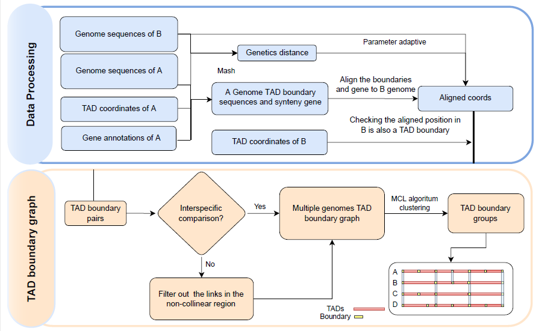
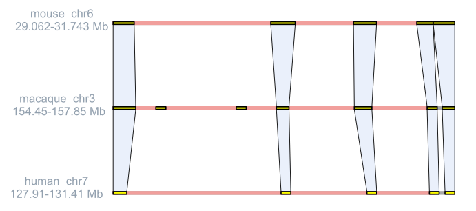
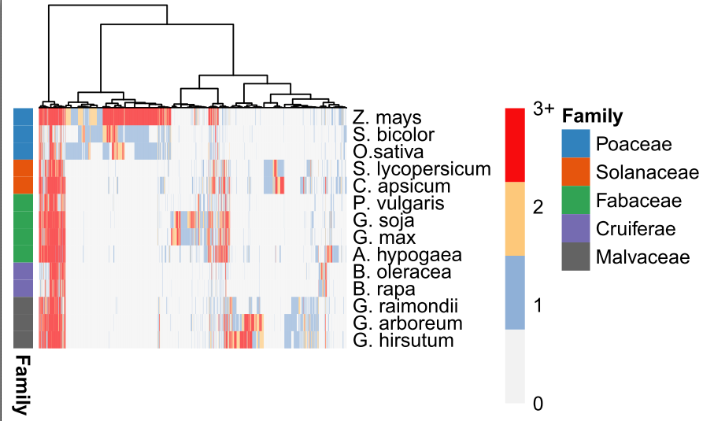

<h1 align="center">Tcbf</h1>
<p align="center">
    <em> ❤️ Tcbf = Topological association domain(TAD) Conservative Boundary Finder</em>
</p>
<p>
    <a href="https://opensource.org/licenses/MIT">
        
    </a>
</p>

[中文文档](static/TcbfUserManual.docx)

## 📣 Introduction
___
TADs are fundamental regulatory chromatin structures and are
largely conserved across tissues and species. We developed 
a python pipeline Tcbf to identify the conservative TAD boundary between
multiple genome.


___
## ✨ Pre-requisite:
### [MCL](https://github.com/micans/mcl)
The mcl clustering algorithm is available in the
repositories of some Linux distributions and so can be
installed in the same way as any other package. 
For example, on Ubuntu, Debian, Linux Mint:

`sudo apt-get install mcl`


Alternatively, it can be built from source which 
will likely require the 'build-essential'
or equivalent package on the Linux distribution being 
used. Instructions are provided on the MCL webpage, 
http://micans.org/mcl/.

### [Minimap2](https://github.com/lh3/minimap2)
The default aligner is minimap2. In the future, we will consider supporting more aligner.

### [Mash](https://github.com/marbl/Mash)
Mash is used to measure the genetics distance between different genome sequences and adjust the alignment parameters.


### R language and the following packages

```
install.packages("BiocManager")
BiocManager::install("GenomicRanges")
BioManager::install("plyranges")
install.packages("tidyverse")
```

### Python >= 3.6
This package is heavily dependent on f-string. As of Python 3.6, f-strings are a great new way to format strings. Not only are they more readable, more concise, and less prone to error than other ways of
formatting, but they are also faster!
___
## 🔰 Installation

[//]: # (**pip install**)

[//]: # (```shell)

[//]: # (pip install Tcbf)

[//]: # (```)

**Install from source**
```shell
git clone https://github.com/hexin010101/Tcbf
cd Tcbf
pip install -r requirements.txt
python setup.py develop
```

### Quick installation using docker container


`docker pull Tcbf`

Singularity container source


`singularity pull Tcbf.sif docker://Tcbf`

### Conda install
`conda install tcbf`
___
## 📝 Usage

You can test the Tcbf pipeline with a toy project. which takes about five mins.
To run Tcbf on the example Data:
```
cd example;
bash download.sh;
Tcbf.py run -c config.txt  -o test
```
### Advanced
For HPC users have multiple nodes, we also provide a step by step to accelerate work.
```
tcbf run -c config.txt  -o test --only_print_command
```
For more details, see [Here]()

### Inputs
The config.txt is a table file with four columns. 
The first columns is path of genome sequence path in FASTA format.

The second columns is TAD annotaed file, which generated from [HiTAD](https://xiaotaowang.github.io/TADLib/hitad.html).


The third column is the individual name.

the fouth columns in gene annotation file in gff3 format


Of note, pay attention to the contigs or scaffolds. For organisms have well assembly,
we usually recommand to remove all scaffolds.
```
genome1.fasta   genome1_tad.txt g1  genome1.gff3
genome2.fasta   genome2_tad.txt g2  genome2.gff3
genome3.fasta   genome3_tad.txt g3  genome3.gff3
genome4.fasta   genome4_tad.txt g4  genome4.gff3
```

we use the results from [HiTAD](https://academic.oup.com/nar/article/45/19/e163/4093166) 
as the TAD annotate file 
```
#cat genome1_tad.txt
Chr01   0       2300000
Chr01   2300000 3950000
Chr01   3950000 4600000
Chr01   4600000 5900000
Chr01   5900000 6350000
```


### Output
For conserved TAD boundaries among species, we provide a table file to show the 
the clustering results. This table has one TAD boundary group per line and one spcies per column and is ordered
from largest orthogroup to smallest.


| g1                                                  | g2                                   |
|-----------------------------------------------------|--------------------------------------|
| g1_0_left_first,g1_12_left_middle,g1_25_left_middle | g2_12_left_middle                    |
| g1_34_left_first,g1_34_left_middlee                 | g2_124_right_last,g2_14_left_middle, |


### Visualization
The user can input a region of  genome, 
and the software can automatically obtain the corresponding 
three-dimensional structural relationship.
The red part in the figure represents the TAD range, and the yellow rectangle represents the TAD boundary. Light blue indicates collinear pairs.


`tcbf plot-syn-pair -o out -reference human --chrom chr7 -start 127910000 -end 131410000 -plot example.pdf`


For heatmap visualization of multiple species, please refer to [Here](example/heatmap.R) or [online document](https://github.com/hexin010101/Tcbf/example/heatmap.R).


## 😉 Author
Tbcf are maintained by: * [@HeXin](https://github.com/hexin010101)


For more Help, Please leave a message in the issue, 
I will reply as soon as possible.


## 📃 License

MIT 
